# Birdie

Birdie is a social media platform designed to bring back a bit of nostalgia for times when birds were blue. 

It fosters community a sense of community through engagement. User is able to post their thoughts and images, but also like and comment posts, as well as - and this is crucial for preserving a sense of peace in these busy times - save posts for later.

Are you growing tired of "People who you might know" sections of social media? Are you deliberatelly choosing apps which allow you to simply be connected to people you don't necessarilly know? If so, this app might be just for you.
Our target audience are regular internet users who like to stay in touch with others without a sense of responsibility. Letting your thoughts simply fly off into their own can be freeing.

[View the live website](https://birdie-app-3064fd5d3b6f.herokuapp.com/)
> **Note**: To open link in a new browser tab, press CTRL + Click.

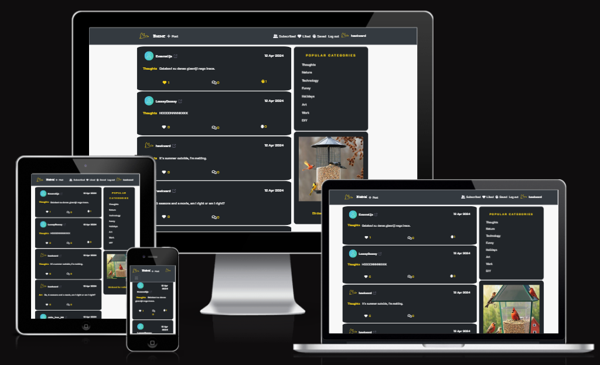

---

## User Experience (UX)

Birdie user experience is designed to integrate both - interaction and engagement - within the virtual community. New visitors have an opportunity to get a glimpse of it by browsing through recent posts or focus on particular categories. Regardless of their screen size, all is only a click away, at most. Upon logging in, users are able to like or save posts for later as they go, or comment on specific posts. But most importantly, users are able to posts their own thoughts as well as update their profiles as much or as little as they wish. In order to attract new users as well as promote community building, only users are able to visit each others' profiles or comment on the posts.

### Goals

Birdie aims to provide the safe space to share your opinions and thoughts while enjoying some quirky and beaky puns.

### Agile Methodology

Agile Methodology was used to organize tasks. User stories were written out and included in Project Boards on Github. In order to create user stories, we have created templates as well as labels.

* Establishing [milestones](https://github.com/josipcodes/drf-birdie/milestones?state=closed) led to breaking the overall work down into manageable segments.
* Creating [user stories](https://github.com/josipcodes/drf-birdie/issues?q=is%3Aissue+is%3Aclosed) helped to organize the workload separated into milestones.
* Labels were added to further organize the remaining work as well as prioritize specifics.
* [Project Board](https://github.com/users/josipcodes/projects/8) was used to track the overall progress.

#### Templates

 User Story Template

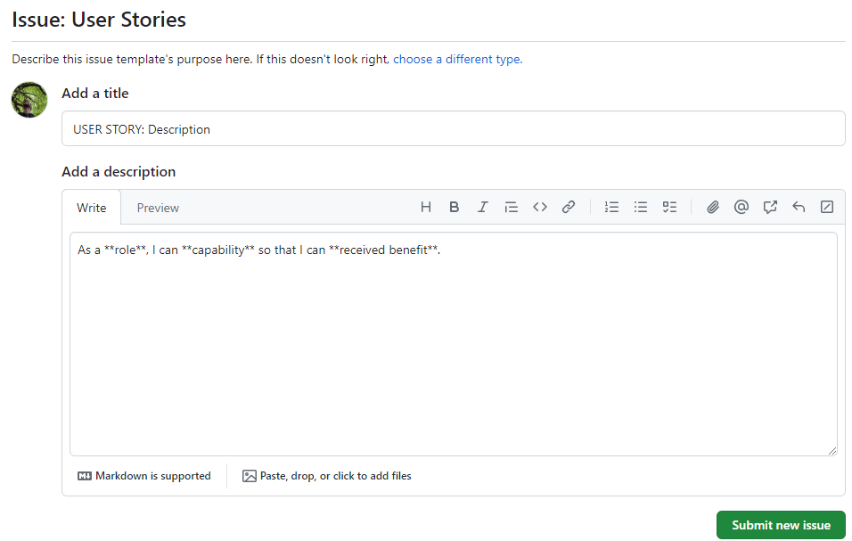

 Bug Report Template

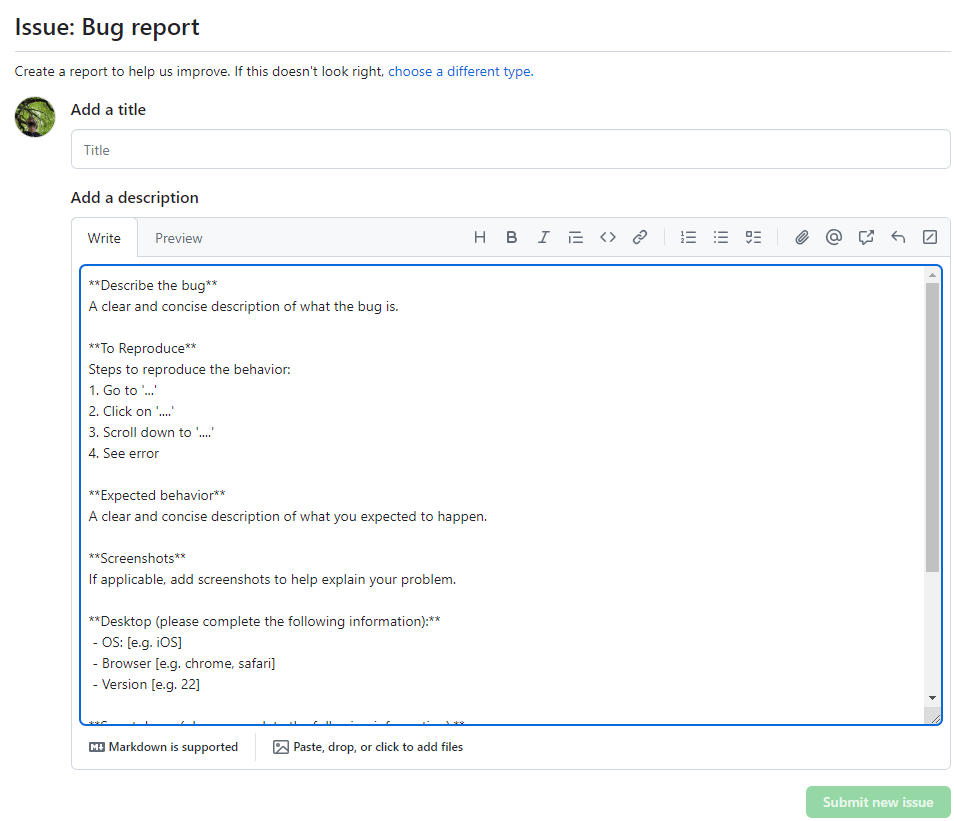

#### Milestones

 Milestones

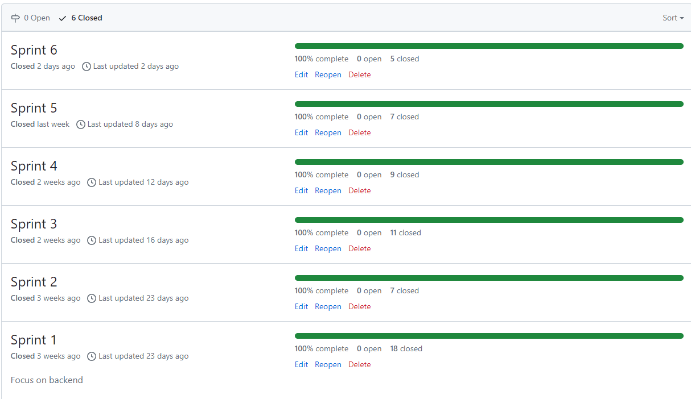

### User stories

 Milestone 1

* Create posts - backend
* Edit post - backend
* View a post - backend
* Delete a post - backend
* Save a post - backend
* Like a post - backend
* Create a comment - backend
* Edit a comment - backend
* Delete comments - backend
* Profile page - backend
* Edit profile - backend
* Sign in - backend
* Sign up - backend
* Logged in status - backend
* Company CRUD
* Product CRUD
* Advertisement CRUD
* Advertisement - backend

 Milestone 2

* Navbar
* Sign in - frontend
* Sign up - frontend
* Refreshing access tokens
* Avatar
* 404
* Category creation

 Milestone 3

* Conditional rendering
* Logged in status - frontend
* Create posts - frontend
* View a post - frontend
* Edit post - frontend
* Delete a post - frontend
* Post page
* View most recent posts
* View saved posts
* View liked posts
* View posts of followed users

 Milestone 4

* Popular categories
* Create a comment - frontend
* View comments
* Edit a comment - frontend
* Delete comments - frontend
* Like a post - frontend
* Unike a post - frontend
* Save a post - frontend
* Unsave a post - frontend

 Milestone 5

* Quick navigation
* Infinite scroll
* User stats
* Profile page - frontend
* Follow/Unfollow a user
* View all posts by a specific user
* Update username and password - frontend

 Milestone 6

* Edit profile - frontend
* Favicon
* Advertisement - frontend
* bug - User can't like/unlike/save/unsave when on a profile page
* bug - Profile displays all posts

### Design

Birdie's design is characterized by a contrasting layout that emphasises user interaction and overall engagement. This can be observed by the general layout; on wider screens, posts hold a central position, inviting discussion or the introvert's equivalent - liking. On the right hand side, user can view the most popular categories, as well as one of our adds. This way, user can at any time feel in full control of their experience. On smaller devices, posts again hold the main position, with popular categories being available in the collapsible navbar, while adds are now displayed when visiting others' profiles.

## Color scheme

I used [coolors.co](https://coolors.co/f8f8f8-212529-fcd619-f2f2f7-242a3d-2e343a-5f5f72-d49113) to generate my colour palette:

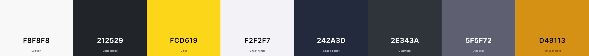

- `#f8f8f8` used for primary text color.
- `#212529` user as primary background.
- `#fcd619` used as a primary button color as well as icon hover color.
- `#f2f2f7` used as a secondary text/element color, mainly for dropdown and non-vital information.
- `#242a3d` used as a secondary element color.
- `#2e343a` used as a secondary background color.
- `#5f5f72` used as a tertiary icon colour to display visual hint.
- `#d49113` used as a border color for secondary backgrounds.

## Typography

- [K2D](https://fonts.google.com/specimen/K2D) was used for the primary text.

- [Permanent Marker](https://fonts.google.com/?query=permanent+marker) was used for the brand display.

- [Font Awesome](https://fontawesome.com) icons were used for various icons/visual hints.

## Logo

Logo was borrowed from [icons8](https://icons8.com/icons/set/bird/).

## Wireframes

To follow best practice, wireframes were developed for mobile, and desktop sizes using [Balsamiq](https://balsamiq.cloud/) to design my site wireframes.

 Desktop

| Desktop main | Deskop main, logged in | Deskop, profile |
| --- | --- | --- |
| 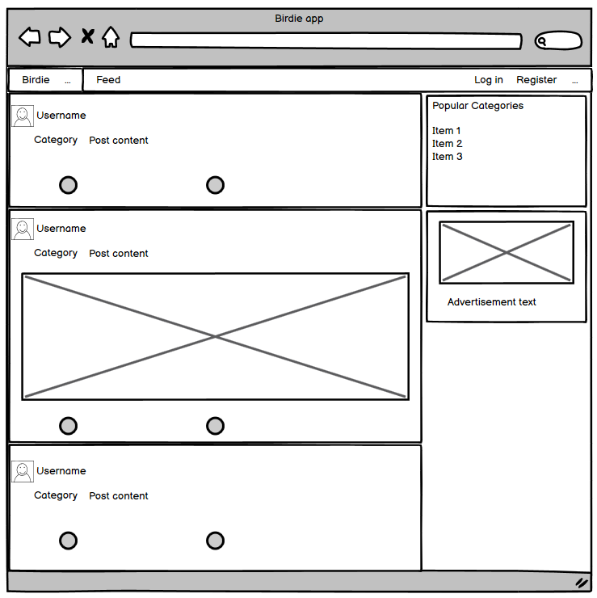 | 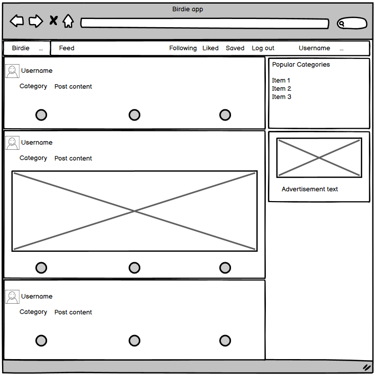 | 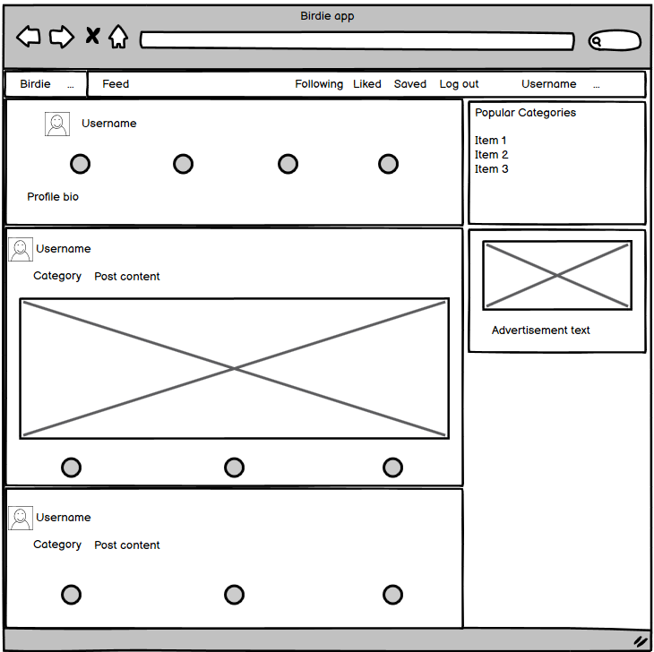 |

 Phone

| Mobile main | Mobile, profile |
| --- | --- |
| 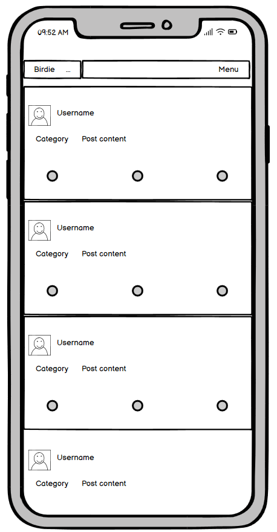 |  |

## Models

1. `User model` - default user model provided by the Django. No alternations made.
---
2. `Profiles model`
* Linked to the User model via `owner` foreign key.
* Includes fields: id, owner, created (`DateTimeField`), modified (`DateTimeField`), bio (`TextField`), avatar (`ImageField`), name (`CharField`).
* Serializer incorporates fields `followers_count`, `following_count`, `posts_count` and `saved_count` used to display user stats.
---
3. `Posts model`
* Linked to the User model via `owner` foreign key.
* Linked to the Category model via `category` foreign key.
* Includes fields: id, owner, created (`DateTimeField`), modified (`DateTimeField`), content (`TextField`), image (`ImageField`), category.
---
4. `Likes model`
* Linked to the User model via `owner` foreign key.
* Linked to the Post model via `post` foreign key.
* Includes fields: id, owner, post (`related_name='likes'`), created (`DateTimeField`).
* Uses unique_together (`owner`, `post`) to prevent duplicating liking posts.
---
5. `Saved posts model`
* Linked to the User model via `owner` foreign key.
* Linked to the Post model via `post` foreign key.
* Includes fields: id, owner, post (`related_name='saved'`), created (`DateTimeField`).
* Uses unique_together (`owner`, `post`) to prevent duplicating saving posts.
---
6. `Comments model`
* Linked to the User model via `owner` foreign key.
* Linked to the Post model via `post` foreign key.
* Includes fields: id, owner, post, created (`DateTimeField`), modified (`DateTimeField`), content (`TextField`).
* Serializer incorporates fields `profile_id` and `profile_avatar` utilised to display username and avatar when commenting or with the commment.
---
7. `Followers model`
* Linked to the User model via `owner` and `followed` foreign keys.
* Includes fields: id, owner, followed, created (`DateTimeField`).
* Uses unique_together (`owner`, `followed`) to prevent duplicating following.
---
8. `Categories model`
* Includes fields: id, name (`CharField`), description (`TextField`).
* Serializer incorporates field `posts_count` utilised to display categories in order of popularity.
---
9. `Companies model`
* Includes fields: id, company_name (`CharField`), internal_notes (`TextField`). 
---
10. `Products model`
* Linked to the Company model via `company_name` foreign key.
* Includes fields: id, product_name (`CharField`), company_name, description (`TextField`). 
---
11. `Advertisements model`
* Linked to the Product model via `product` foreign key.
* Includes fields: id, product, description (`TextField`), contract_start (`DateTimeField`), contract_end (`DateTimeField`), money (`DecimalField`), image (`ImageField`), alt (`CharField`).

### Database scheme

Entity-Relationship Diagram contains User as the foundation for all user-related interactions, such as posting, liking, saving, commenting, categorising as well as following.

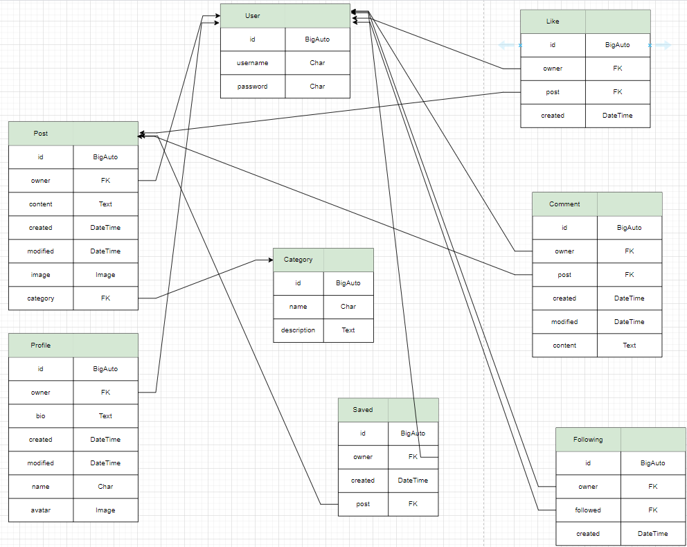

Entity-Relationship Diagram contains Company as the foundation for all advertisement based actions. As a brand, we are able to display various advertisements for various products of different companies based on the validity of the contract.

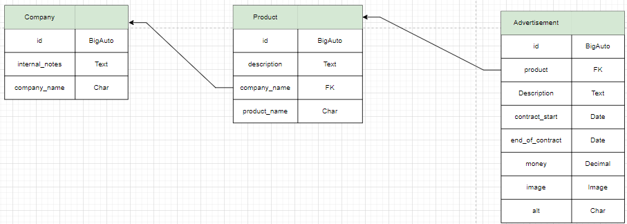
