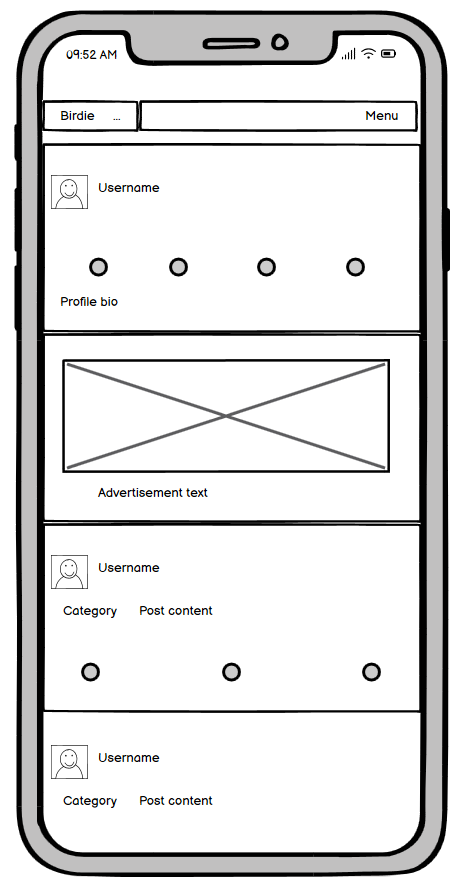

# Birdie

Birdie is a social media platform designed to bring back a bit of nostalgia for times when birds were blue. 

It fosters a sense of community through engagement. User is able to post their thoughts and images, but also like and comment posts, as well as - and this is crucial for preserving a sense of peace in these busy times - save posts for later.

Are you growing tired of "People who you might know" sections of social media? Are you deliberatelly choosing apps which allow you to simply be connected to people you don't necessarilly know? If so, this app might be just for you.
Our target audience are regular internet users who like to stay in touch with others without a sense of responsibility. Letting your thoughts simply fly off into their own can be freeing.

[View the live website](https://birdie-app-3064fd5d3b6f.herokuapp.com/)
> **Note**: To open link in a new browser tab, press CTRL + Click.


## Table of Contents

### [User Experience](#user-experience-1)

#### [Goals](#goals-1)

#### [Agile Methodology](#agile-methodology-1)

##### [Templates](#templates-1)

##### [Milestones](#milestones-1)

#### [User stories](#user-stories-1)

#### [Design](#design-1)

##### [Color scheme](#color-scheme-1)

##### [Typography](#typography-1)

##### [Logo](#logo-1)

##### [Wireframes](#wireframes-1)

### [Models](#models-1)

#### [Database scheme](#database-scheme-1)

### [Features](#features-1)

#### [Security Features](#security-features-1)

##### [Authentication](#authentication-1)

##### [Form validation](#form-validation-1)

##### [404](#404-1)

##### [User redirection](#user-redirection-1)

#### [Existing features](#existing-features-1)

#### [Future features](#future-features-1)

### [Technologies used](#technologies-used-1)

### [Testing](#testing-1)

### [Deployment and Local Developement](#deployment-and-local-developement-1)

#### [ElephantSQL Database](#elephantsql-database-1)

#### [Cloudinary API](#cloudinary-api-1)

#### [Heroku Deployment](#heroku-deployment-1)

#### [Local Deployment](#local-deployment-1)

##### [Cloning](#cloning-1)

##### [Forking](#forking-1)

#### [Local VS Deployment](#local-vs-deployment-1)

### [References](#references-1)

#### [Sources](#sources-1)

#### [Media](#media-1)

### [Acknowledgments](#acknowledgments-1)


---

## User Experience

Birdie user experience is designed to integrate both - interaction and engagement - within the virtual community. New visitors have an opportunity to get a glimpse of it by browsing through recent posts or focus on particular categories. Regardless of their screen size, all is only a click away, at most. Upon logging in, users are able to like or save posts for later as they go, or comment on specific posts. But most importantly, users are able to posts their own thoughts as well as update their profiles as much or as little as they wish. In order to attract new users as well as promote community building, only users are able to visit each others' profiles or comment on the posts.

### Goals

Birdie aims to provide the safe space to share your opinions and thoughts while enjoying some quirky and beaky puns.

### Agile Methodology

Agile Methodology was used to organize tasks. User stories were written out and included in Project Boards on Github. In order to create user stories, we have created templates as well as labels.

* Establishing [milestones](https://github.com/josipcodes/drf-birdie/milestones?state=closed) led to breaking the overall work down into manageable segments.
* Creating [user stories](https://github.com/josipcodes/drf-birdie/issues?q=is%3Aissue+is%3Aclosed) helped to organize the workload separated into milestones.
* Labels were added to further organize the remaining work as well as prioritize specifics.
* [Project Board](https://github.com/users/josipcodes/projects/8) was used to track the overall progress.

#### Templates
<details>
<summary> User Story Template
</summary>


</details>

<details>
<summary> Bug Report Template
</summary>


</details>

#### Milestones
<details>
<summary> Milestones
</summary>


</details>

### User stories

<details>
<summary> Milestone 1
</summary>

* Create posts - backend
* Edit post - backend
* View a post - backend
* Delete a post - backend
* Save a post - backend
* Like a post - backend
* Create a comment - backend
* Edit a comment - backend
* Delete comments - backend
* Profile page - backend
* Edit profile - backend
* Sign in - backend
* Sign up - backend
* Logged in status - backend
* Company CRUD
* Product CRUD
* Advertisement CRUD
* Advertisement - backend
</details>

<details>
<summary> Milestone 2
</summary>

* Navbar
* Sign in - frontend
* Sign up - frontend
* Refreshing access tokens
* Avatar
* 404
* Category creation
</details>

<details>
<summary> Milestone 3
</summary>

* Conditional rendering
* Logged in status - frontend
* Create posts - frontend
* View a post - frontend
* Edit post - frontend
* Delete a post - frontend
* Post page
* View most recent posts
* View saved posts
* View liked posts
* View posts of followed users
</details>

<details>
<summary> Milestone 4
</summary>

* Popular categories
* Create a comment - frontend
* View comments
* Edit a comment - frontend
* Delete comments - frontend
* Like a post - frontend
* Unike a post - frontend
* Save a post - frontend
* Unsave a post - frontend
</details>

<details>
<summary> Milestone 5
</summary>

* Quick navigation
* Infinite scroll
* User stats
* Profile page - frontend
* Follow/Unfollow a user
* View all posts by a specific user
* Update username and password - frontend
</details>

<details>
<summary> Milestone 6
</summary>

* Edit profile - frontend
* Favicon
* Advertisement - frontend
* bug - User can't like/unlike/save/unsave when on a profile page
* bug - Profile displays all posts
</details>

### Design

Birdie's design is characterized by a contrasting layout that emphasises user interaction and overall engagement. This can be observed by the general layout; on wider screens, posts hold a central position, inviting discussion or the introvert's equivalent - liking. On the right hand side, user can view the most popular categories, as well as one of our adds. This way, user can at any time feel in full control of their experience. On smaller devices, posts again hold the main position, with popular categories being available in the collapsible navbar, while adds are now displayed when visiting others' profiles.

#### Color scheme

I used [coolors.co](https://coolors.co/f8f8f8-212529-fcd619-f2f2f7-242a3d-2e343a-5f5f72-d49113) to generate my colour palette:


- `#f8f8f8` used for primary text color.
- `#212529` user as primary background.
- `#fcd619` used as a primary button color as well as icon hover color.
- `#f2f2f7` used as a secondary text/element color, mainly for dropdown and non-vital information.
- `#242a3d` used as a secondary element color.
- `#2e343a` used as a secondary background color.
- `#5f5f72` used as a tertiary icon colour to display visual hint.
- `#d49113` used as a border color for secondary backgrounds.

#### Typography

- [K2D](https://fonts.google.com/specimen/K2D) was used for the primary text.

- [Permanent Marker](https://fonts.google.com/?query=permanent+marker) was used for the brand display.

- [Font Awesome](https://fontawesome.com) icons were used for various icons/visual hints.

#### Logo

Logo was borrowed from [icons8](https://icons8.com/icons/set/bird/).

##### Wireframes

To follow best practice, wireframes were developed for mobile, and desktop sizes using [Balsamiq](https://balsamiq.cloud/) to design my site wireframes.

<details>
<summary> Desktop
</summary>

| Desktop main | Deskop main, logged in | Deskop, profile |
| --- | --- | --- |
|  |  |  |
</details>

<details>
<summary> Phone
</summary>

| Mobile main | Mobile, profile |
| --- | --- |
|  |  |
</details>

## Models

1. `User model` - default user model provided by the Django. No alternations made.
---
2. `Profiles model`
* Linked to the User model via `owner` foreign key.
* Includes fields: id, owner, created (`DateTimeField`), modified (`DateTimeField`), bio (`TextField`), avatar (`ImageField`), name (`CharField`).
* Serializer incorporates fields `followers_count`, `following_count`, `posts_count` and `saved_count` used to display user stats.
---
3. `Posts model`
* Linked to the User model via `owner` foreign key.
* Linked to the Category model via `category` foreign key.
* Includes fields: id, owner, created (`DateTimeField`), modified (`DateTimeField`), content (`TextField`), image (`ImageField`), category.
---
4. `Likes model`
* Linked to the User model via `owner` foreign key.
* Linked to the Post model via `post` foreign key.
* Includes fields: id, owner, post (`related_name='likes'`), created (`DateTimeField`).
* Uses unique_together (`owner`, `post`) to prevent duplicating liking posts.
---
5. `Saved posts model`
* Linked to the User model via `owner` foreign key.
* Linked to the Post model via `post` foreign key.
* Includes fields: id, owner, post (`related_name='saved'`), created (`DateTimeField`).
* Uses unique_together (`owner`, `post`) to prevent duplicating saving posts.
---
6. `Comments model`
* Linked to the User model via `owner` foreign key.
* Linked to the Post model via `post` foreign key.
* Includes fields: id, owner, post, created (`DateTimeField`), modified (`DateTimeField`), content (`TextField`).
* Serializer incorporates fields `profile_id` and `profile_avatar` utilised to display username and avatar when commenting or with the commment.
---
7. `Followers model`
* Linked to the User model via `owner` and `followed` foreign keys.
* Includes fields: id, owner, followed, created (`DateTimeField`).
* Uses unique_together (`owner`, `followed`) to prevent duplicating following.
---
8. `Categories model`
* Includes fields: id, name (`CharField`), description (`TextField`).
* Serializer incorporates field `posts_count` utilised to display categories in order of popularity.
---
9. `Companies model`
* Includes fields: id, company_name (`CharField`), internal_notes (`TextField`). 
---
10. `Products model`
* Linked to the Company model via `company_name` foreign key.
* Includes fields: id, product_name (`CharField`), company_name, description (`TextField`). 
---
11. `Advertisements model`
* Linked to the Product model via `product` foreign key.
* Includes fields: id, product, description (`TextField`), contract_start (`DateTimeField`), contract_end (`DateTimeField`), money (`DecimalField`), image (`ImageField`), alt (`CharField`).

### Database scheme

Entity-Relationship Diagram contains User as the foundation for all user-related interactions, such as posting, liking, saving, commenting, categorising as well as following.


Entity-Relationship Diagram contains Company as the foundation for all advertisement based actions. As a brand, we are able to display various advertisements for various products of different companies based on the validity of the contract. Regular user is not able to perform CRUD funcionality on anything advertisement related, and Admin is the only person able to access some of the data in order to protect the brand.


## Features

### Security Features

#### Authentication

Birdie leverages Django REST Framework's permission classes such as isOwnerOrReadOnly as well as IsAdminUser in order to regulate user actions.

Object owners have full control over their items, they are free to create, update or remove/delete their posts, comments, likes and saves. Profile owner is able to update their bio as well as change their avatar. 

Frontend interface adapts the display based on a user's role and authentication state. This approach ensures a secure and personalized user journey, offering access and functionalities aligned with the user's role and authentication credentials.

#### Form validation

Birdie includes form validation, in order to keep the user in the loop regarding potential user-driven errors.

#### 404

Birdie has a custom 404 page. User is able to navigate to an existing page using existing `navbar`.

#### User redirection

In the instances where user attempts to access a page which does exist, but they don't have sufficient privelages, Birdie redirects the user to either login, or the main page, depending on the circumstances.

### Existing features

<details>
<summary> Visitor Home page
</summary>


* Displays a navigation bar with logo, posts, categories and adds.
</details>

<details>
<summary> Regular user Home page
</summary>


* Displays a navigation bar with logo, posts, categories and adds. `Navbar` allows for user options.
</details>

<details>
<summary> Logo
</summary>


* Logo is displayed in the `navbar` at all times.
</details>

<details>
<summary> Favicon
</summary>


* Favicon is visible in the tab bar.
</details>

<details>
<summary> Navbar
</summary>


* Navbar allows user to visit various pages. It collapses on smaller screens without users losing access to features.
</details>

<details>
<summary> Active page
</summary>


* Page user is currently on is highlighted in the navbar when applicable.
</details>

<details>
<summary> Categories
</summary>


* Popular categories allow users access to posts in specific categories.
</details>

<details>
<summary> Advertisements
</summary>


* Advertisements are displaying randomly, as long as their contract is valid.
</details>

<details>
<summary> Post creation
</summary>


* Valid users can create new posts.
</details>

<details>
<summary> Post dropdown
</summary>


* Post owner has access to a post dropdown which provides additional options.
</details>

<details>
<summary> Post edit
</summary>


* Post owner can edit their post.
</details>

<details>
<summary> Post delete
</summary>


* Post owner can delete their posts.
</details>

<details>
<summary> Post liking
</summary>


* Valid user can like others' posts.
</details>

<details>
<summary> Post saving
</summary>


* Valid user can save others' posts.
</details>

<details>
<summary> Commenting
</summary>


* Valid user can comment on posts.
</details>

<details>
<summary> Comment dropdown
</summary>


* Comment owner has access to a comment dropdown which provides additional options.
</details>

<details>
<summary> Comment edit
</summary>


* Comment owner can edit a comment.
</details>

<details>
<summary> Comment delete
</summary>


* Comment owner can delete a comment.
</details>

<details>
<summary> Liked posts
</summary>


* Authenticated user has access to the posts they liked.
</details>

<details>
<summary> Saved posts
</summary>


* Authenticated user has access to the posts they saved.
</details>

<details>
<summary> Subscribed posts
</summary>


* Authenticated user has access to the posts of users they subscribed to.
</details>

<details>
<summary> Categories page
</summary>


* All users can navigate to a specific category in order to read related posts.
</details>

<details>
<summary> User stats
</summary>


* Profile page displays user stats.
</details>

<details>
<summary> Profile dropdown
</summary>


* Profile owner has access to a profile dropdown.
</details>

<details>
<summary> Profile edit
</summary>


* Profile owner can edit their profile.
</details>

<details>
<summary> Default avatar
</summary>


* Profile owner can edit their profile.
</details>

<details>
<summary> Change username
</summary>


* Profile owner can change their username.
</details>

<details>
<summary> Change password
</summary>


* Profile owner can change their password.
</details>

<details>
<summary> 404 page
</summary>


* Custom 404 page is displaying when user enters invalid url.
</details>

<details>
<summary> Form validation
</summary>


* Form validation notiifies user of any errors.
</details>

<details>
<summary> Notifications
</summary>


* Newer users might encounter notifications guiding them to a better process, mainly when no results are found due to a lack of interaction with others.
</details>

<details>
<summary> Registration page
</summary>


* New users have access to registration page. If they already have an account, link is available to navigate to the login page.
</details>

<details>
<summary> Login page
</summary>


* Unauthenticated users have access to login page. If they don't already have an account, link is available to navigate to the registration page.
</details>

<details>
<summary> Logout page
</summary>


* Authenticated users have access to the logout page. 
</details>

<details>
<summary> Admin panel
</summary>


* Admin panel is accessible by appending url with `/admin` and providing credentials. Among other things, admin has access to companies contracting Birdie to display advertisements, their products and actual advertisements. On top of that, admin can create new categories.
</details>

### Future features

* Category page
* Deleting avatar
* Post category as a link
* Deleting post image
* Comments visible on the main feed
* Following display
* Search functionality
* User notifications

[Project board](https://github.com/users/josipcodes/projects/8) contains rational behind not implementing these features at the present moment.

## Technologies used

<details>
<summary> Languages
</summary>

* [HTML5](https://en.wikipedia.org/wiki/HTML5)
* [CSS3](https://en.wikipedia.org/wiki/CSS)
* [JavaScript](https://en.wikipedia.org/wiki/JavaScript)
* [Python](https://en.wikipedia.org/wiki/Python_(programming_language)) 
</details>

<details>
<summary> Databases
</summary>

* [ElephantSQL](https://www.elephantsql.com/) - Postgres database
* [Cloudinary](https://cloudinary.com/) - Online static file storage
</details>

<details>
<summary> Frameworks
</summary>

* [Django REST framework](https://www.django-rest-framework.org/)
* [React Bootstrap](https://react-bootstrap.netlify.app/)
* [React](https://react.dev/)
</details>

<details>
<summary> Tools
</summary>

* [Github](https://github.com/) - Online code storage.
* [Gitpod](https://www.gitpod.io/) - Cloud development environment.
* [Heroku](https://www.heroku.com/) - Cloud-based platform used for site deployment.
* [Google Fonts](https://fonts.google.com/) - Fonts.
* [Git](https://git-scm.com/) - Version control.
* [NPM](https://www.npmjs.com/) - Package manager to install dependencies.
* [Axios](https://axios-http.com/) - Simple promise based HTTP client.
* [Postman](https://www.postman.com/) - Used to troubleshoot POST requests.
* [Am I Responsive](https://ui.dev/amiresponsive) - Responsiveness presentation in readme.
* [Coolors](https://coolors.co/) - Color Scheme.
* [GoFullPage](https://chromewebstore.google.com/detail/gofullpage-full-page-scre/fdpohaocaechififmbbbbbknoalclacl) - Testing screenshots.
* [Responsive Viewer](https://chromewebstore.google.com/detail/responsive-viewer/inmopeiepgfljkpkidclfgbgbmfcennb) - Responsiveness testing.
* [W3C Markup Validation Service](https://validator.w3.org/) - HTML validation.
* [CSS Validation Service](https://jigsaw.w3.org/css-validator/) - CSS validation.
* [CI Python Linter](https://pep8ci.herokuapp.com/) - Python validation.
* [ESLint](https://eslint.org/) - Used to validate React code.
* [Balsamiq](https://balsamiq.com/) - Used to create wireframes.
* [draw.io](https://draw.io/) - Used to create database schema.
</details>

<details>
<summary> Components
</summary>

* [Add](frontend/src/components/Add.js) - used to fetch and display advertisements.
* [Asset](frontend/src/components/Asset.js) - used to display messages, spinner...
* [Avatar](frontend/src/components/Avatar.js) - used to display username and avatar.
* [Comment](frontend/src/components/Comment.js) - used to display and delete comments.
* [Dropdowns](frontend/src/components/Dropdowns.js) - used to display profile/post/comment dropdowns.
* [NavBar](frontend/src/components/NavBar.js) - used to display dinamic navbar.
* [PageNotFound](frontend/src/components/PageNotFound.js) - used to display 404 page.
* [PopularCategories](frontend/src/components/PopularCategories.js)  - used to fetch and display categories.
</details>

<details>
<summary> Hooks
</summary>

* [useNavBarToggle](frontend/src/hooks/useNavBarToggle.js) - used to toggle NavBar in order to preserve good user experience.
* [useRedirect](frontend/src/hooks/useRedirect.js) - used to redirect user when necessary.
* [useScreenWidth](frontend/src/hooks/useScreenWidth.js) - used to dinamically render the app based on the current screen width, in order to avoid hidding rendered elements when not necessary.
</details>

<details>
<summary> Contexts
</summary>

* [CurrentUserContext](frontend/src/contexts/CurrentUserContext.js) - used to get current users authentication state and refresh/remove Tokens when necessary.
* [SelectedCategoryContext](frontend/src/contexts/SelectedCategoryContext.js) - used to assist with providing various pages with category id when user clicks on a popular category.
</details>

## Testing

Please see [TESTING.md](TESTING.md) for more regarding testing performed.

## Deployment and Local Developement

The live deployed application can be found deployed on [Heroku](https://birdie-app-3064fd5d3b6f.herokuapp.com/).

### ElephantSQL Database

This project uses [ElephantSQL](https://www.elephantsql.com) for the PostgreSQL Database.

To obtain your own Postgres Database, sign-up with your GitHub account, then follow these steps:

- Click **Create New Instance** to start a new database.
- Provide a name (this is commonly the name of the project: community-helper).
- Select the **Tiny Turtle (Free)** plan.
- You can leave the **Tags** blank.
- Select the **Region** and **Data Center** closest to you.
- Once created, click on the new database name, where you can view the database URL and Password.

### Cloudinary API

This project uses the [Cloudinary API](https://cloudinary.com) to store media assets online, due to the fact that Heroku doesn't persist this type of data.

To obtain your own Cloudinary API key, create an account and log in.

- For *Primary interest*, you can choose *Programmable Media for image and video API*.
- Optional: *edit your assigned cloud name to something more memorable*.
- On your Cloudinary Dashboard, you can copy your **API Environment Variable**.
- Be sure to remove the `CLOUDINARY_URL=` as part of the API **value**; this is the **key**.

### Heroku Deployment

This project uses [Heroku](https://www.heroku.com), a platform as a service (PaaS) that enables developers to build, run, and operate applications entirely in the cloud.

Deployment steps are as follows, after account setup:

- Select **New** in the top-right corner of your Heroku Dashboard, and select **Create new app** from the dropdown menu.
- Your app name must be unique. Next, choose a region closest to you (EU or USA), and finally, select **Create App**.
- From the new app **Settings**, click **Reveal Config Vars**, and set your environment variables.

| Key | Value |
| --- | --- |
| `CLOUDINARY_URL` | user's own value obtained from Cloudinary |
| `DATABASE_URL` | user's own value obtained from ElephantSQL |
| `DISABLE_COLLECTSTATIC` | 1 (*this is temporary, and can be removed for the final deployment*) |
| `SECRET_KEY` | user's own value |
| `ALLOWED_HOST` | user's app url without `https://` and `/` |
| `CLIENT_ORIGIN` | user's app url without the final `/` |


Heroku needs two additional files in order to deploy properly.

- requirements.txt
- Procfile

You can install this project's **requirements** (where applicable) using:

- `pip3 install -r requirements.txt`

If you have your own packages that have been installed, the requirements file needs updating. Do so using:

- `pip3 freeze --local > requirements.txt`

The **Procfile** can be created with the following command:

- `echo web: gunicorn app_name.wsgi > Procfile`
- *replace **app_name** with the name of your primary Django app name; the folder where settings.py is located*

For Heroku deployment, follow these steps to connect your own GitHub repository to the newly created app:

Either:

- Select **Automatic Deployment** from the Heroku app.

Or:

- In the Terminal/CLI, connect to Heroku using this command: `heroku login -i`
- Set the remote for Heroku: `heroku git:remote -a app_name` (replace *app_name* with your app name)
- After performing the standard Git `add`, `commit`, and `push` to GitHub, you can now type:
	- `git push heroku main`

The project should now be connected and deployed to Heroku!

If you experience issues creating Heroku account:
- Make sure you have accepted cookies.
- Try using an email address from a different provider.

### Local Deployment

This project can be cloned or forked in order to make a local copy on your own system.

For either method, you will need to install any applicable packages found within the *requirements.txt* file.

- `pip3 install -r requirements.txt`.

You will need to create a new file called `env.py` at the root-level,
and include the same environment variables listed above from the Heroku deployment steps.

Sample `env.py` file:

```python
import os

os.environ["DATABASE_URL"] = "user's own value"
os.environ["SECRET_KEY"] = "user's own value"
os.environ["CLOUDINARY_URL"] = "user's own value"
os.environ['ALLOWED_HOST'] = "user's development app url without https:// and /"
os.environ['CLIENT_ORIGIN'] = "user's development app url without the final /"

# local environment only (do not include these in production!)
os.environ['DEV'] = '1'
os.environ['DEBUG'] = '1'
```

Once the project is cloned or forked, in order to run it locally, you'll need to follow these steps:

- Start the Django app: `python3 manage.py runserver`
- Stop the app once it's loaded: `CTRL+C` or `⌘+C` (Mac)
- Make any necessary migrations: `python3 manage.py makemigrations`
- Migrate the data to the database: `python3 manage.py migrate`
- Create a superuser: `python3 manage.py createsuperuser`
- Load fixtures (if applicable): `python3 manage.py loaddata file-name.json` (repeat for each file)
- Everything should be ready now, so run the Django app again: `python3 manage.py runserver`
- In another terminal, change the directory to the frontend folder: `cd frontend`
- Start frontend server: `npm start`
- If you see an error when starting frontend server, use: `nvm install 16`, followed by `nvm use 16`, then start server again

#### Cloning

You can clone the repository by following these steps:

1. Go to the [GitHub repository](https://github.com/josipcodes/drf-birdie) 
2. Locate the Code button above the list of files and click it 
3. Select if you prefer to clone using HTTPS, SSH, or GitHub CLI and click the copy button to copy the URL to your clipboard
4. Open Git Bash or Terminal
5. Change the current working directory to the one where you want the cloned directory
6. In your IDE Terminal, type the following command to clone my repository:
	- `git clone https://github.com/josipcodes/drf-birdie.git`
7. Press Enter to create your local clone.

Alternatively, if using Gitpod, you can click below to create your own workspace using this repository.

[](https://gitpod.io/#https://github.com/josipcodes/drf-birdie)

Please note that in order to directly open the project in Gitpod, you need to have the browser extension installed.
A tutorial on how to do that can be found [here](https://www.gitpod.io/docs/configure/user-settings/browser-extension).

#### Forking

By forking the GitHub Repository, we make a copy of the original repository on our GitHub account to view and/or make changes without affecting the original owner's repository.
You can fork this repository by using the following steps:

1. Log in to GitHub and locate the [GitHub Repository](https://github.com/josipcodes/drf-birdie)
2. At the top of the Repository (not top of page) just above the "Settings" Button on the menu, locate the "Fork" Button.
3. Once clicked, you should now have a copy of the original repository in your own GitHub account!

### Local VS Deployment

Local version uses variables stored in `env.py` file while deployed version uses Heroku's `config vars`.

Deployment with changes to static files or React code requires use of `npm run build && rm -rf ../staticfiles/build && mv build ../staticfiles/.` before pushing the code in order to delete and replace the staticfiles folder.

## References

### Sources

* [Moments](https://github.com/Code-Institute-Solutions/moments) - project has been based off of CI's Moments.
* [drf_api](https://github.com/Code-Institute-Solutions/drf-api) - project has been based off of CI's drf_api.
* [django-filter](https://django-filter.readthedocs.io/en/stable/) - django filter
* [djangoproject](https://docs.djangoproject.com/en/3.2/ref/signals/) - signals, post_save.connect() method
* [django-allauth](https://docs.allauth.org/en/latest/) - 
* [django-rest-framework](https://www.django-rest-framework.org/api-guide/permissions/) - isAdminUser, isOwnerOrReadOnly
* [npm](https://www.npmjs.com/package/react-router-dom/v/5.3.0) - react-router-dom
* [axios-http](https://axios-http.com/docs/interceptors) - axios interceptors
* [altcademy](https://www.altcademy.com/blog/how-to-check-screen-width-in-reactjs/) - screen width check
* [react-bootstrap](https://react-bootstrap-v4.netlify.app/components/navbar/) - navbar
* [react-bootstrap](https://react-bootstrap.netlify.app/docs/components/spinners/) - spinner
* [react-bootstrap](https://react-bootstrap-v4.netlify.app/components/dropdowns/) - dropdowns
* [geeksforgeeks](https://www.geeksforgeeks.org/decimalfield-django-models/) - DecimalField
* [Stackoverflow](https://stackoverflow.com/questions/31281208/where-to-override-jwt-expiration-delta-for-setting-custom-token-expiration-time) - jwt auth expiration
* [medium](https://medium.com/django-rest/django-rest-framework-jwt-authentication-94bee36f2af8#:~:text=Default%20Simple%20JWT%20Settings%20%3A,is%20valid%20for%2024%20hours) - lifetime of jwt auth
* [w3schools](https://www.w3schools.com/tags/att_option_disabled.asp) - disabled option
* [reactrouter](https://reactrouter.com/en/main/hooks/use-location) - useLocation
* [getbootstrap](https://getbootstrap.com/docs/4.6/utilities/flex/) - flex
* [DhiWise](https://www.dhiwise.com/post/handling-multiple-and-conditional-onclick-events-in-react) - conditional onClick
* [Stackoverflow](https://stackoverflow.com/questions/72348762/compare-date-from-a-database-to-current-date-and-alert-user-if-its-late) - validating dates
* [w3schools](https://www.w3schools.com/django/django_queryset_filter.php) - filtering advertisements
* [Stackoverflow](https://stackoverflow.com/questions/45228187/possible-to-filter-the-queryset-after-querying-django) - filtering advertisements
* [testing-library](https://testing-library.com/docs/dom-testing-library/api-async/) - waitFor
* [django-rest-framework](https://www.django-rest-framework.org/api-guide/serializers/) - followers serializers
* [Stackoverflow](https://stackoverflow.com/questions/32443471/django-show-the-count-of-related-objects-in-admin-list-display) - Count of posts in a category
* [Pillow](https://pypi.org/project/pillow/) - images
* [django-rest-framework](https://www.django-rest-framework.org/tutorial/3-class-based-views/) - views
* [django-rest-framework](https://www.django-rest-framework.org/api-guide/status-codes/) - statuses
* [django-rest-framework](https://www.django-rest-framework.org/tutorial/4-authentication-and-permissions/) - authentication
* [django-rest-framework](https://www.django-rest-framework.org/api-guide/permissions/) - permissions
* [django-rest-framework](https://www.django-rest-framework.org/api-guide/relations/) - category display
* [medium](https://rajansahu713.medium.com/mastering-the-art-of-django-test-cases-fa7b0322c9fb) - backend testing
* [github](https://github.com/josipcodes/community-helper/blob/main/README.md) - deployment steps

### Media

* [Font Awesome](https://fontawesome.com/) - Icons used throughout the site.
* [Unsplash](https://unsplash.com/photos/low-angle-photography-of-brown-bird-ic-13C3QhAI) - Image used for pages such as auth forms, 404 page.
* [deepai](https://deepai.org/machine-learning-model/cute-creature-generator) - Used to generate images used in posts.
* [gencraft](https://gencraft.com/generate) - Used to generate advertisement images.
* [icons8](https://icons8.com) - Used to obtain logo/favicon image.
* [pixabay](https://pixabay.com/vectors/user-icon-person-personal-about-me-2517433/) - Default avatar image.

## Acknowledgments 

* First of all, I have to thank my mentor, [Iullia Konovalova](https://github.com/IuliiaKonovalova) for ideas, support, laughter and words of wisdom. 
* I would also like to thank Sean, Oisin and Roman. Not sure if they know how much tears they've spared me.
* Massive thanks to [Aoife](https://github.com/akirby23) for our daily stand ups. Keeping each other sane since 2019, I believe.
* Additional thanks to all my friends who, surpisingly, don't mind bird puns.